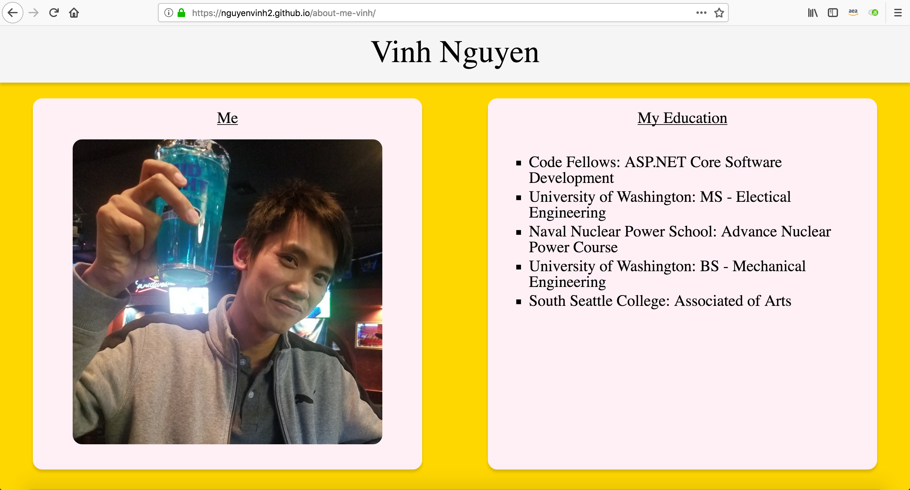

# [about-me-vinh](https://nguyenvinh2.github.io/about-me-vinh/)

## Intro

    This Web Application is for a introductory JavaScript course and is meant to make use of the alert 
    and prompt statements. It asks the user to answer 5 questions in a yes/no format concerning details 
    about the author.

## Author

    Vinh Nguyen
    
## Installation

    No installation is needed.

    You may clone this repo and utilize it to your liking.

    VSCODE is recommended for editing files.

## Version

    Date Initiated: 03/26/19

    V 0.5: 03/27/19 - JS rewritten to fulfill assignment requirement. Additional questions added.

    V 0.6: 3/28/19 - Added more HTML content

## Output

