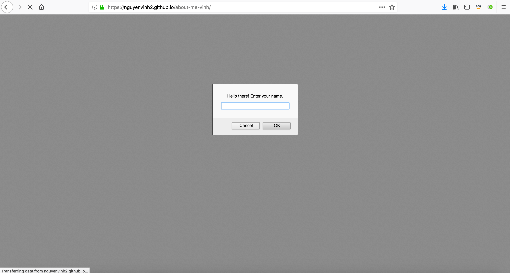

# about-me-vinh

[About Me](https://nguyenvinh2.github.io/about-me-vinh/)

## Intro

    This Web Application is for a introductory JavaScript course and is meant to make use of the alert 
    and prompt statements. It asks the user to answer 5 questions in a yes/no format concerning details 
    about the author.

## Installation

    No installation is needed.

    You may clone this repo and utilize it to your liking.

    A Code Editor is required for editing. VS CODE is recommended.

## Author

    Vinh Nguyen

## Version

    Date Initiated: 03/26/19
    V 0.5: 03/27/19 - Javascript rewritten to fulfill assignment requirement of no functions. Additional
    questions added.

## Output

